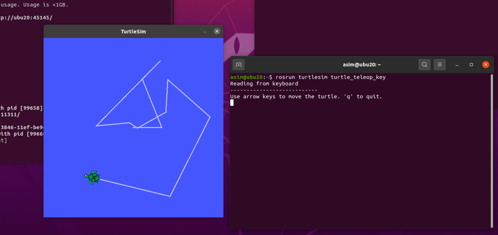

# Week 2 AI Task 2: Manipulate with Turtlesim Package in ROS Noetic and ROS2 Foxy


## Table of Contents
1. [Introduction](#introduction)
2. [Prerequisites](#prerequisites)
3. [Manipulating Turtlesim in ROS Noetic](#manipulating-turtlesim-in-ros-noetic)
4. [Manipulating Turtlesim in ROS2 Foxy](#manipulating-turtlesim-in-ros2-foxy)
5. [Conclusion](#conclusion)

## Introduction
This document provides step-by-step instructions to manipulate the `turtlesim` package in both ROS Noetic and ROS2 Foxy. `turtlesim` is a popular simulation tool used in the ROS community to demonstrate basic ROS concepts.

## Prerequisites
- ROS Noetic installed on Ubuntu 20.04
- ROS2 Foxy installed on Ubuntu 20.04 or Ubuntu 22.04
- A user account with sudo privileges

## Manipulating Turtlesim in ROS Noetic

### Step 1: Install Turtlesim
```sh
sudo apt update
sudo apt install ros-noetic-turtlesim
```


### Step 2: Launch Turtlesim
```sh
roscore
```

Open a new terminal and run:
```sh
rosrun turtlesim turtlesim_node
```


### Step 3: Move the Turtle
Open another terminal and run:
```sh
rosrun turtlesim turtle_teleop_key
```
Use the arrow keys to move the turtle around the screen.


### Step 4: Drawing Shapes
You can draw shapes by publishing velocity commands to the `/turtle1/cmd_vel` topic. For example, to draw a square, use the following script:
```sh
rostopic pub -r 1 /turtle1/cmd_vel geometry_msgs/Twist "linear:
  x: 2.0
  y: 0.0
  z: 0.0
angular:
  x: 0.0
  y: 0.0
  z: 1.57"
```
Run this command and observe the turtle drawing a square.


## Manipulating Turtlesim in ROS2 Foxy

### Step 1: Install Turtlesim
```sh
sudo apt update
sudo apt install ros-foxy-turtlesim
```

### Step 2: Launch Turtlesim
```sh
ros2 run turtlesim turtlesim_node
```

### Step 3: Move the Turtle
In a new terminal, use the `teleop` package to control the turtle:
```sh
ros2 run turtlesim turtle_teleop_key
```
Use the arrow keys to move the turtle around the screen.

### Step 4: Drawing Shapes
To draw shapes, publish velocity commands to the `/turtle1/cmd_vel` topic. For example, to draw a square, use the following script:
```sh
ros2 topic pub /turtle1/cmd_vel geometry_msgs/msg/Twist "{linear: {x: 2.0, y: 0.0, z: 0.0}, angular: {x: 0.0, y: 0.0, z: 1.57}}"
```
Run this command and observe the turtle drawing a square.

## Conclusion
This document covered the steps to manipulate the `turtlesim` package in both ROS Noetic and ROS2 Foxy. By following these instructions, you should be able to control the turtle and create basic shapes, demonstrating your understanding of ROS topics and commands.
