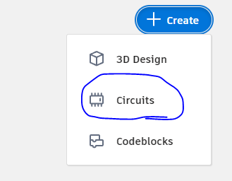
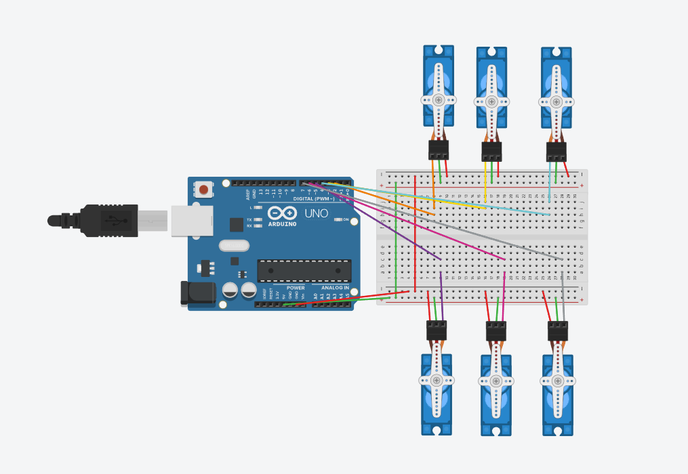
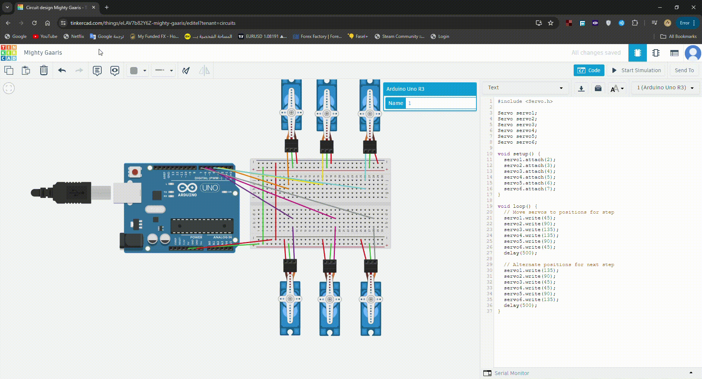

# Week 2 Electronic Engineering Tasks

## Task 1: Writing an Algorithm to Control Servo Motors for Robot Walking Motion

### Introduction
In this task, we will write an algorithm to control servo motors to create a walking motion for a robot. We will use 6 servo motors, 3 for each leg, to achieve this.

### Algorithm
1. **Initialize Servos**: Define and initialize the servo motors for each joint.
2. **Walking Gait Sequence**:
    - Define the positions for each servo motor to create a step.
    - Alternate the sequence for each leg to simulate walking.

```python
import time
import board
import pwmio
from adafruit_motor import servo

# Initialize PWM channels for each servo motor
servo1 = servo.Servo(pwmio.PWMOut(board.D2))
servo2 = servo.Servo(pwmio.PWMOut(board.D3))
servo3 = servo.Servo(pwmio.PWMOut(board.D4))
servo4 = servo.Servo(pwmio.PWMOut(board.D5))
servo5 = servo.Servo(pwmio.PWMOut(board.D6))
servo6 = servo.Servo(pwmio.PWMOut(board.D7))

def step_forward():
    # Move servos to positions for step
    servo1.angle = 45
    servo2.angle = 90
    servo3.angle = 135
    servo4.angle = 135
    servo5.angle = 90
    servo6.angle = 45
    time.sleep(0.5)

    # Alternate positions for next step
    servo1.angle = 135
    servo2.angle = 90
    servo3.angle = 45
    servo4.angle = 45
    servo5.angle = 90
    servo6.angle = 135
    time.sleep(0.5)

while True:
    step_forward()
```

### Conclusion
This algorithm provides a basic structure to control 6 servo motors to create a walking motion for a robot. The sequence of movements can be adjusted to refine the walking gait.

## Task 2: Connect and Program a Circuit with 6 Servo Motors on Tinkercad

### Introduction
In this task, we will create a circuit on Tinkercad that includes 6 servo motors and write a program to control them.

### Steps to Create the Circuit
1. **Create a New Circuit**:
    - Go to [Tinkercad](https://www.tinkercad.com/).
    - Create a new circuit project.



2. **Add Components**:
    - Add an Arduino Uno to the workspace.
    - Add 6 servo motors.
    - Connect the signal pins of the servos to digital pins on the Arduino (e.g., D2 to D7).
    - Connect the power and ground pins of the servos to the Arduino.



3. **Program the Arduino**:
    - Write the code to control the servos.


### Example Code

```cpp
#include <Servo.h>

Servo servo1;
Servo servo2;
Servo servo3;
Servo servo4;
Servo servo5;
Servo servo6;

void setup() {
  servo1.attach(2);
  servo2.attach(3);
  servo3.attach(4);
  servo4.attach(5);
  servo5.attach(6);
  servo6.attach(7);
}

void loop() {
  // Move servos to positions for step
  servo1.write(45);
  servo2.write(90);
  servo3.write(135);
  servo4.write(135);
  servo5.write(90);
  servo6.write(45);
  delay(500);

  // Alternate positions for next step
  servo1.write(135);
  servo2.write(90);
  servo3.write(45);
  servo4.write(45);
  servo5.write(90);
  servo6.write(135);
  delay(500);
}
```

### Conclusion
By following these steps, you can create a circuit with 6 servo motors on Tinkercad and program it to simulate a walking motion for a robot.


