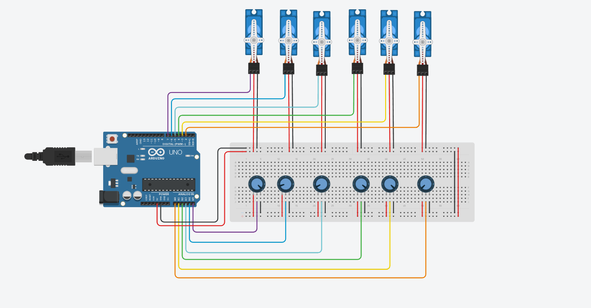
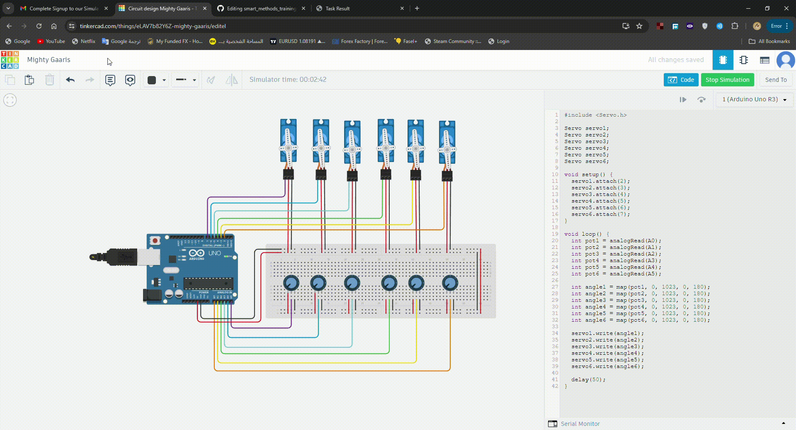

# Week 2 Electronic Engineering Tasks

## Task 1: Writing an Algorithm to Control Servo Motors for Robot Walking Motion

### Introduction
In this task, we will write an algorithm to control servo motors to create a walking motion for a robot. We will use 6 servo motors, 3 for each leg, to achieve this.

### Algorithm
1. **Initialize Servos**: Define and initialize the servo motors for each joint.
2. **Walking Gait Sequence**:
    - Define the positions for each servo motor to create a step.
    - Alternate the sequence for each leg to simulate walking.

```python
import time
import board
import pwmio
from adafruit_motor import servo

# Initialize PWM channels for each servo motor
servo1 = servo.Servo(pwmio.PWMOut(board.D2))
servo2 = servo.Servo(pwmio.PWMOut(board.D3))
servo3 = servo.Servo(pwmio.PWMOut(board.D4))
servo4 = servo.Servo(pwmio.PWMOut(board.D5))
servo5 = servo.Servo(pwmio.PWMOut(board.D6))
servo6 = servo.Servo(pwmio.PWMOut(board.D7))

def step_forward():
    # Move servos to positions for step
    servo1.angle = 45
    servo2.angle = 90
    servo3.angle = 135
    servo4.angle = 135
    servo5.angle = 90
    servo6.angle = 45
    time.sleep(0.5)

    # Alternate positions for next step
    servo1.angle = 135
    servo2.angle = 90
    servo3.angle = 45
    servo4.angle = 45
    servo5.angle = 90
    servo6.angle = 135
    time.sleep(0.5)

while True:
    step_forward()
```

### Conclusion
This algorithm provides a basic structure to control 6 servo motors to create a walking motion for a robot. The sequence of movements can be adjusted to refine the walking gait.

# Task 2: Connect and Program a Circuit with 6 Servo Motors and 6 Potentiometers on Tinkercad

## Introduction
In this task, we will create a circuit on Tinkercad that includes 6 servo motors and 6 potentiometers and write a program to control them.

## Steps to Create the Circuit
1. **Create a New Circuit**:
    - Go to [Tinkercad](https://www.tinkercad.com/).
    - Create a new circuit project.
  
   


2. **Add Components**:
    - Add an Arduino Uno to the workspace.
    - Add 6 servo motors.
    - Add 6 potentiometers.
    - Connect the signal pins of the servos to digital pins on the Arduino (e.g., D2 to D7).
    - Connect the power and ground pins of the servos to the Arduino.
    - Connect the middle pin of each potentiometer to analog pins on the Arduino (e.g., A0 to A5).
    - Connect the outer pins of the potentiometers to 5V and GND on the Arduino.
  




## Program the Arduino
Write the code to control the servo motors based on the potentiometer values.




```cpp
#include <Servo.h>

Servo servo1;
Servo servo2;
Servo servo3;
Servo servo4;
Servo servo5;
Servo servo6;

void setup() {
  servo1.attach(2);
  servo2.attach(3);
  servo3.attach(4);
  servo4.attach(5);
  servo5.attach(6);
  servo6.attach(7);
}

void loop() {
  int pot1 = analogRead(A0);
  int pot2 = analogRead(A1);
  int pot3 = analogRead(A2);
  int pot4 = analogRead(A3);
  int pot5 = analogRead(A4);
  int pot6 = analogRead(A5);

  int angle1 = map(pot1, 0, 1023, 0, 180);
  int angle2 = map(pot2, 0, 1023, 0, 180);
  int angle3 = map(pot3, 0, 1023, 0, 180);
  int angle4 = map(pot4, 0, 1023, 0, 180);
  int angle5 = map(pot5, 0, 1023, 0, 180);
  int angle6 = map(pot6, 0, 1023, 0, 180);

  servo1.write(angle1);
  servo2.write(angle2);
  servo3.write(angle3);
  servo4.write(angle4);
  servo5.write(angle5);
  servo6.write(angle6);

  delay(50);
}
```

## Conclusion
By following these steps, you can create a circuit with 6 servo motors and 6 potentiometers on Tinkercad and program it to control the servo motors based on the potentiometer values.
