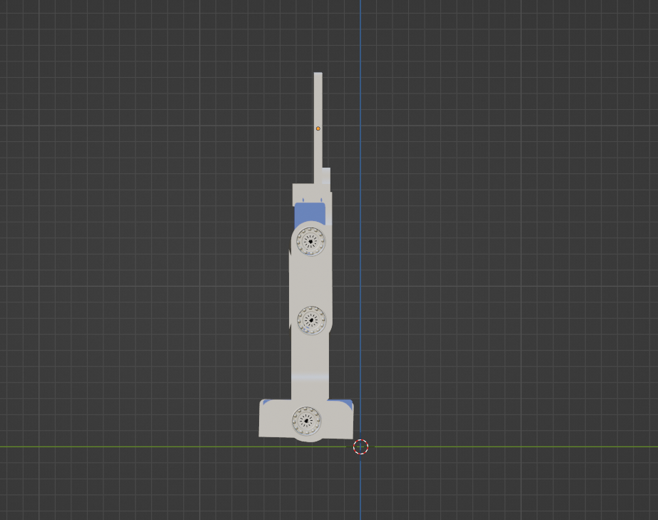
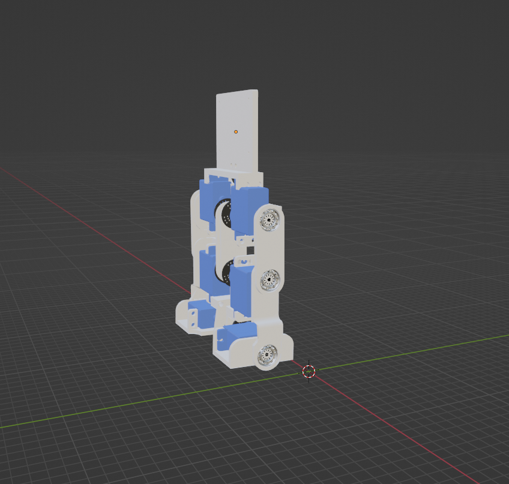
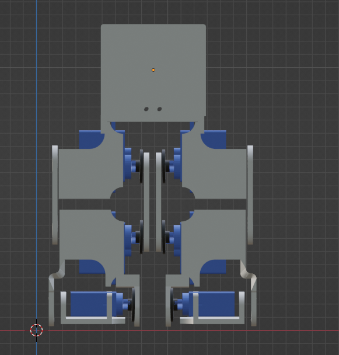
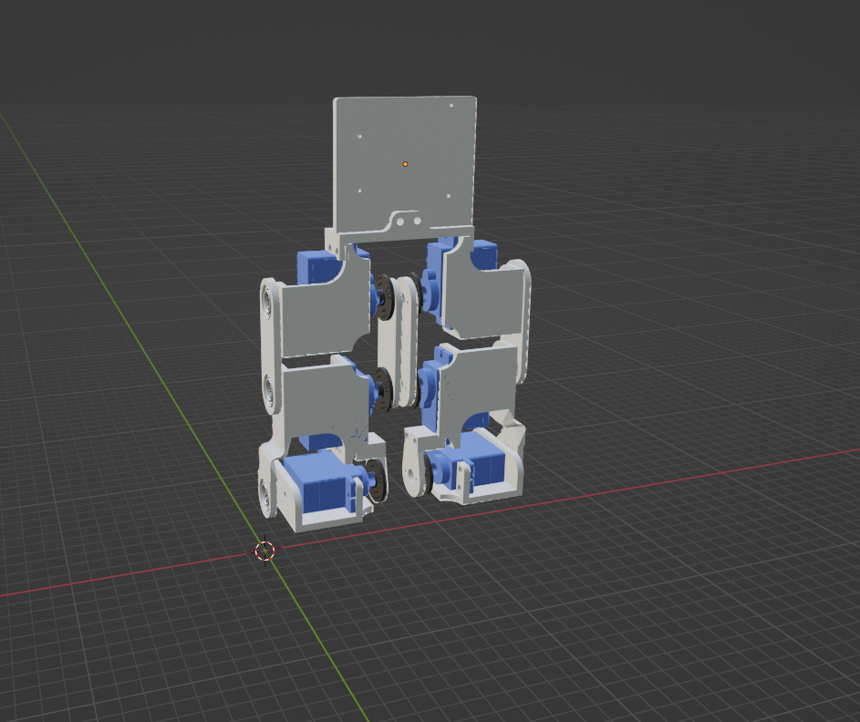
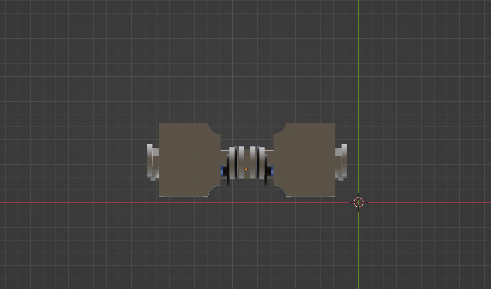

# Week 2 - Mechanical Track Task 1

## Task: Design of Robot Leg Joints Using 6 Motors

This task involves the design of robot leg joints using 6 motors.

## Design Files

The design was created using Blender. Below are the images of the design:
### X View
- 
### X 3D View
- 
### Y View
- 
### Y 3D View
- 
### Z View
- 
### Z 3D View
- 
