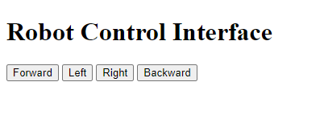
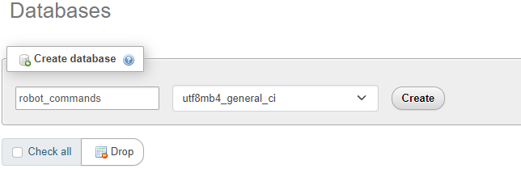
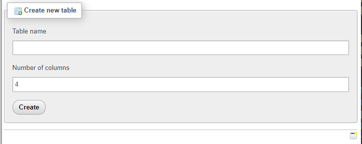

# Week 2 Web and NLP Tasks: Robot Control and Data Display

## Task 1: Building a Web Page for Robot Control and Database Connection

### Table of Contents
1. [Introduction](#introduction)
2. [Prerequisites](#prerequisites)
3. [Setting Up the Control Page](#setting-up-the-control-page)
4. [Creating the Database](#creating-the-database)
5. [Connecting the Web Page to the Database](#connecting-the-web-page-to-the-database)
6. [Conclusion](#conclusion)

### Introduction
This task involves creating a web page that allows users to control the direction of a robot and record these directions in a database. This exercise helps in understanding web development basics and interfacing web applications with databases.

### Prerequisites
- Basic understanding of HTML, CSS, and JavaScript
- Knowledge of PHP and MySQL
- XAMPP installed on your machine

### Setting Up the Control Page

#### Step 1: Create the HTML File (index.html)
Create an `index.html` file with the following content and place it in the `htdocs` directory of your XAMPP installation:
```html
<!DOCTYPE html>
<html lang="en">
<head>
    <meta charset="UTF-8">
    <meta name="viewport" content="width=device-width, initial-scale=1.0">
    <title>Robot Control</title>
</head>
<body>
    <h1>Robot Control Interface</h1>
    <button onclick="sendCommand('forward')">Forward</button>
    <button onclick="sendCommand('left')">Left</button>
    <button onclick="sendCommand('right')">Right</button>
    <button onclick="sendCommand('backward')">Backward</button>

    <script>
        function sendCommand(direction) {
            fetch('command.php', {
                method: 'POST',
                headers: {
                    'Content-Type': 'application/json'
                },
                body: JSON.stringify({ direction: direction })
            })
            .then(response => response.json())
            .then(data => {
                if (data.status === 'success') {
                    alert('Command sent successfully!');
                } else {
                    console.error('Error sending command:', data.message);
                    alert('Error sending command. Please try again.');
                }
            })
            .catch(error => {
                console.error('Error sending command:', error);
                alert('Error sending command. Please try again.');
            });
        }
    </script>
</body>
</html>
```



### Creating the Database

#### Step 2: Create the MySQL Database and Table
Create a MySQL database and table to store the robot commands. Use phpMyAdmin



## or MySQL command line:

```sql
CREATE DATABASE robot_commands;
```
### TABLE



## OR

```sql
USE robot_commands;

CREATE TABLE commands (
    id INT(6) UNSIGNED AUTO_INCREMENT PRIMARY KEY,
    direction VARCHAR(30) NOT NULL,
    reg_date TIMESTAMP DEFAULT CURRENT_TIMESTAMP ON UPDATE CURRENT_TIMESTAMP
);
```

### Connecting the Web Page to the Database

#### Step 3: Create the PHP Backend (command.php)
Create a `command.php` file with the following content and place it in the `htdocs` directory of your XAMPP installation:
```php
<?php
$servername = "localhost";
$username = "root";
$password = "";
$dbname = "robot_commands";

// Create connection
$conn = new mysqli($servername, $username, $password, $dbname);

// Check connection
if ($conn->connect_error) {
    die("Connection failed: " . $conn->connect_error);
}

$input = json_decode(file_get_contents('php://input'), true);
$direction = $input['direction'];

$sql = "INSERT INTO commands (direction) VALUES ('$direction')";

if ($conn->query($sql) === TRUE) {
    echo json_encode(["status" => "success"]);
} else {
    echo json_encode(["status" => "error", "message" => $conn->error]);
}

$conn->close();
?>
```

### Conclusion
This task has provided a complete setup for controlling a robot's direction through a web page and storing commands in a MySQL database using XAMPP. By following these steps, you should have a functional web interface for controlling robot commands.
