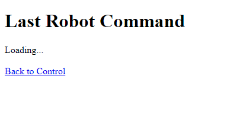

## Task 2: Creating a Web Page to Display Stored Data (Last Value)

### Setting Up the Display Page

#### Step 1: Create the HTML File (display.html)
Create a `display.html` file with the following content and place it in the `htdocs` directory of your XAMPP installation:
```html
<!DOCTYPE html>
<html lang="en">
<head>
    <meta charset="UTF-8">
    <meta name="viewport" content="width=device-width, initial-scale=1.0">
    <title>Last Robot Command</title>
</head>
<body>
    <h1>Last Robot Command</h1>
    <div id="lastCommand">Loading...</div>
    <br>
    <a href="index.html">Back to Control</a> <!-- Link to go back to index.html for control -->

    <script>
        function fetchLastCommand() {
            fetch('fetch_command.php')
                .then(response => response.json())
                .then(data => {
                    document.getElementById('lastCommand').innerText = data.direction;
                })
                .catch(error => {
                    console.error('Error fetching command:', error);
                });
        }

        window.onload = fetchLastCommand;
    </script>
</body>
</html>

```



#### Step 2: Create the PHP Backend (fetch_command.php)
Create a `fetch_command.php` file with the following content and place it in the `htdocs` directory of your XAMPP installation:
```php
<?php
$servername = "localhost";
$username = "root";
$password = "";
$dbname = "robot_commands";

// Create connection
$conn = new mysqli($servername, $username, $password, $dbname);

// Check connection
if ($conn->connect_error) {
    die("Connection failed: " . $conn->connect_error);
}

$sql = "SELECT direction FROM commands ORDER BY id DESC LIMIT 1";
$result = $conn->query($sql);

if ($result->num_rows > 0) {
    $row = $result->fetch_assoc();
    echo json_encode(["direction" => $row["direction"]]);
} else {
    echo json_encode(["direction" => "No commands found"]);
}

$conn->close();
?>
```


### Conclusion
This task has provided a complete setup for displaying the last recorded command of the robot through a web page by fetching the data from a MySQL database using XAMPP. By following these steps, you should have a functional web interface for monitoring robot commands.
